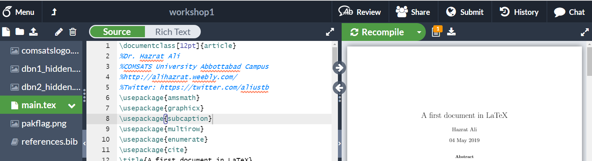

# LaTeX Workshop 2019
## Basic tutorial file on latex document compilation. 
## Very useful and easy to follow note from the workshop I conducted at COMSATS University Abbottabad. 
# How to use the files?
## The files can be uploaded to your _overleaf.com_ account. It is ready to be compiled and **PDF** generation. For making any changes, you may use the **main.tex** file.
After you upload all the files to overleaf, open the main.tex file and hit compile button. You will be able to see a screen as shown in the figure.

# What does it cover?
## The tutorial covers:
1. Basic document generation.
2. Equations in latex
3. Multi line equations in latex.
4. Itemization in latex, such as list of items. 
5. Figures insertion in latex.
6. Sub-figures in latex.
7. Tables in latex
8. Citations and reference management in latex.
## What are in the files?
The **main.tex** file contains the main syntax. The file **references.bib** contains the reference entries. There are four figures uploaded alongwith. 
## Where it comes from?
The tutorial file contains basic LaTeX modules as covered in the one day workshop on LaTeX document compilation, held on 4 May 2019, COMSATS University Abbottabad, jointly organised by Department of Electrical and Computer Engineering and IET on-campus team.
> Disclaimer: Shared for learning purpose. No liabilities accepted.
